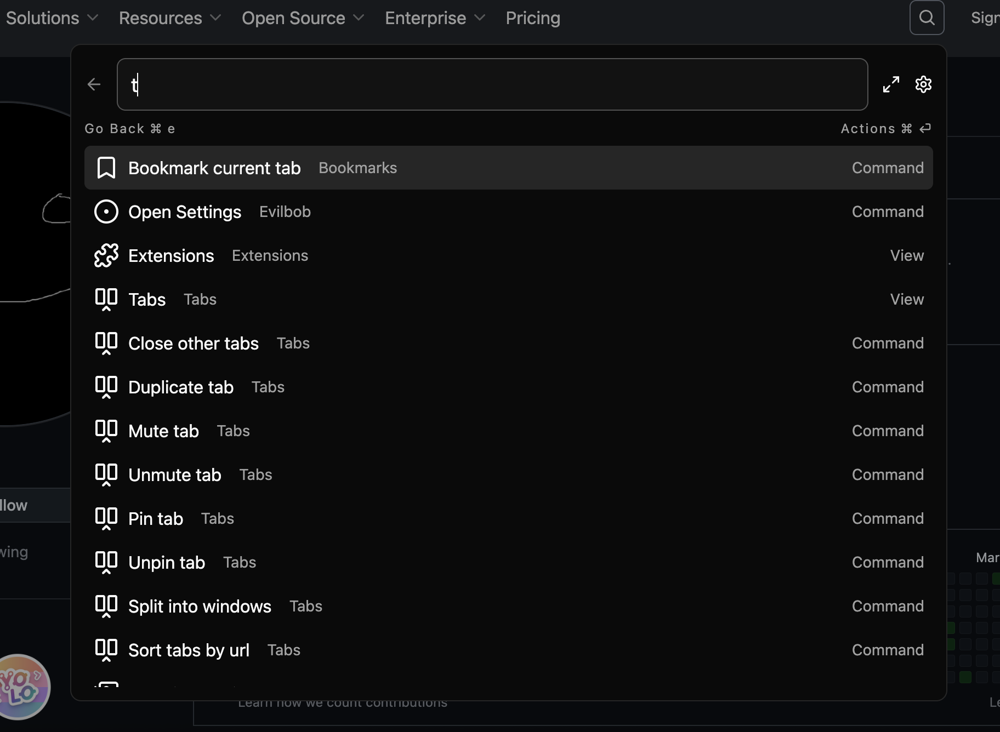
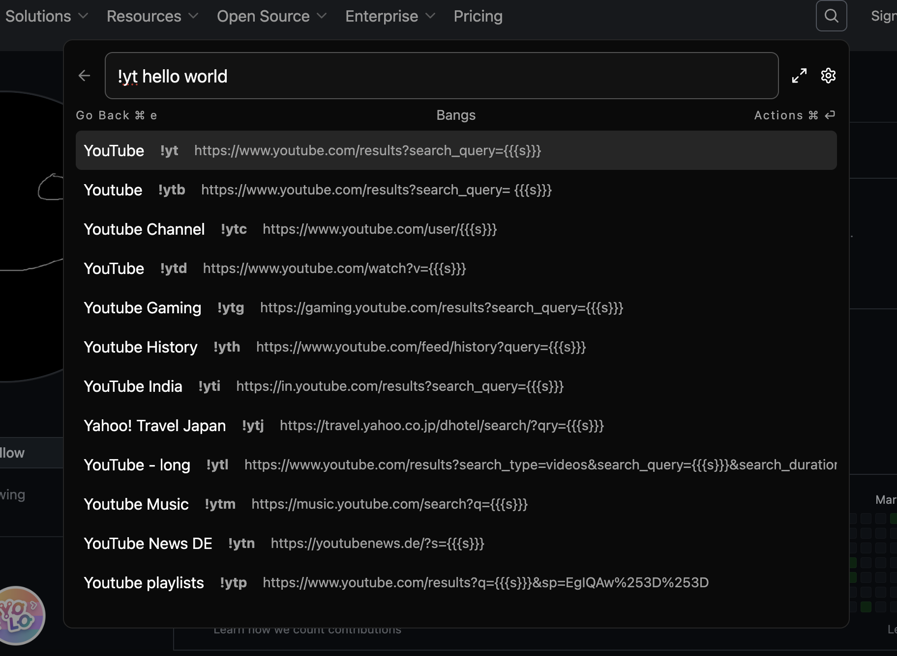
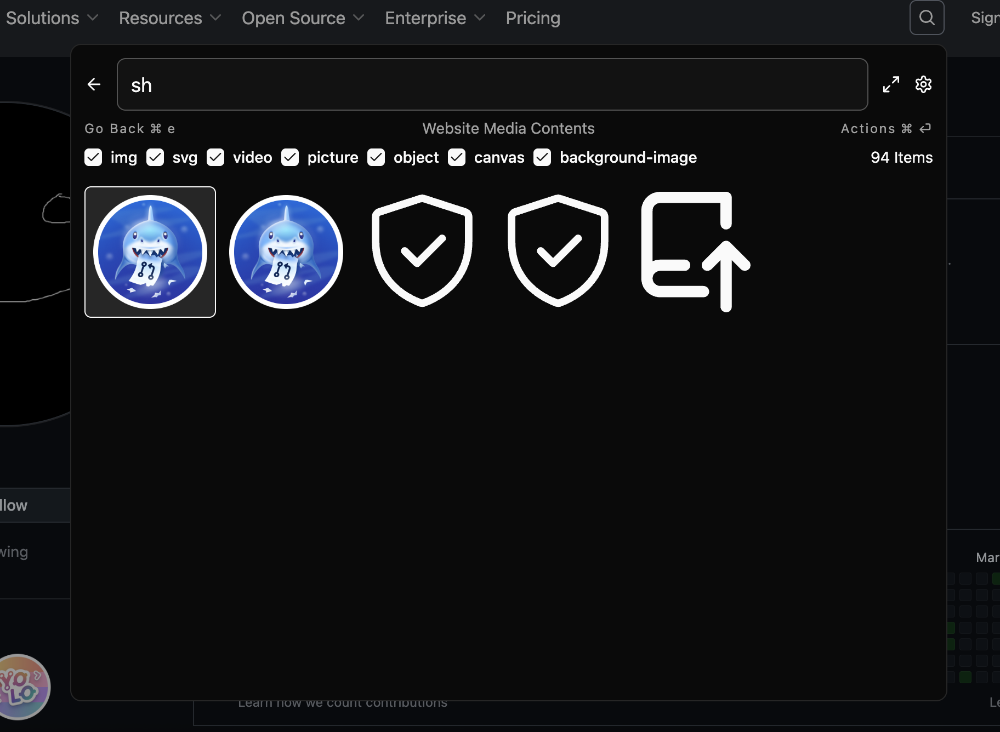

> **_NOTE:_** This browser extension will not be continued as the ultimate goal to provide a raycast like command palette does not comply with the single purpose guideline. Was fun prototyping though :)
> - https://blog.chromium.org/2013/12/keeping-chrome-extensions-simple.html
> - https://developer.chrome.com/docs/webstore/program-policies/quality-guidelines-faq#single-purpose

    

    <a target="_blank" href="https://chromewebstore.google.com/detail/bob-command-palette/ofdklnmcjbihdajkbnfjpcamifkpngdl">Chrome</a>
    •
    <a target="_blank" href="https://addons.mozilla.org/de/firefox/addon/evilbob/">Firefox</a>
    •
    <a target="_blank" href="https://microsoftedge.microsoft.com/addons/detail/bobcommandpalette/nikplhepafilmghdhfkkkbjogblchima">Edge</a>

Evilbob - A powerful command palette prototype for Chromium and Firefox

Access a variety of features from one interface that is fast and customizable.
Quickly search and interact with commands, history, website data and more.
You decide wich plugins you need.

